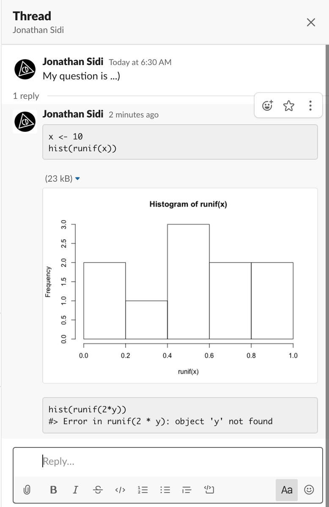

<!-- README.md is generated from README.Rmd. Please edit that file -->

```{r, include = FALSE}
knitr::opts_chunk$set(
  collapse = TRUE,
  comment = "#>",
  fig.path = "man/figures/README-",
  out.width = "100%"
)
```

# slackblocks

<!-- badges: start -->
[](https://www.tidyverse.org/lifecycle/#experimental)
[](http://tinyurl.com/tf2xf4d)
<!-- badges: end -->

The goal of slackblocks is to build Slack block elements in `R`.

## Installation

``` r
# install.packages("remotes")
remotes::install_github("yonicd/slackblocks")
```
## Example

This is a basic example which shows you how to solve a common problem:

```{r example}
library(slackblocks)
```

```{r}
slackblocks::block_text('my text')
```

```{r}
slackblocks::block_image('url_to_image')
```

```{r}
(b <- block_section(
  text = block_text(
    text = 'A message *with some bold text* and _some italicized text_.'),
  fields = list(
    block_text('*Priority*'),
    block_text('*Type*'),
    block_text('High'),
    block_text(':heavy_check_mark:')
    )
  ))
```

## Posting Blocks to Slack

```{r,eval=FALSE}
post_block(b,channel = 'yonicd')
```

```{r,echo=FALSE}
knitr::include_graphics('man/figures/sections.png')
```

## Reprex

```{r,eval = FALSE}
slackteams::load_team_dcf(team = 'r4ds')
slackteams::activate_team('r4ds')

slackblocks::slack_reprex({
x <- 10
hist(runif(x))
},
text = 'i have a question about this plot',
channel = 'yonicd')
```

```{r,echo=FALSE}

```
