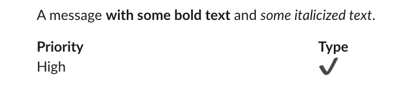

<!-- README.md is generated from README.Rmd. Please edit that file -->

# slackblocks

<!-- badges: start -->

[](https://www.tidyverse.org/lifecycle/#experimental)
[](http://tinyurl.com/tf2xf4d)
[](https://github.com/yonicd/slackblocks/actions/workflows/r-cmd-check.yml)
[](https://codecov.io/gh/yonicd/slackblocks?branch=master)
<!-- badges: end -->

`slackblocks` is a part of `slackverse`

|                                                                                                                                                   |                                                                                                                                             |                                                                                                                                                |
| :-----------------------------------------------------------------------------------------------------------------------------------------------: | :-----------------------------------------------------------------------------------------------------------------------------------------: | :--------------------------------------------------------------------------------------------------------------------------------------------: |
|                                                                                                                                                   | slackcalls<br>[](https://github.com/yonicd/slackcalls) |                                                                                                                                                |
| slackthreads<br>[](https://github.com/yonicd/slackthreads) | slackteams<br>[](https://github.com/yonicd/slackteams) |  slackposts<br>[](https://github.com/yonicd/slackposts)   |
|                                                                                                                                                   |                                                                                                                                             | slackblocks<br>[](https://github.com/yonicd/slackblocks) |
|                                                                                                                                                   |                                                                                                                                             | slackreprex<br>[](https://github.com/yonicd/slackreprex) |

The goal of slackblocks is to build Slack block elements in `R`.

## Installation

``` r
# install.packages("remotes")
remotes::install_github("yonicd/slackblocks")
```

## Example

This is a basic example which shows you how to solve a common problem:

``` r
library(slackblocks)
```

``` r
block_text('my text')
#> {
#>   "type": "mrkdwn",
#>   "text": "my text"
#> }
```

``` r
image_element('url_to_image')
#> {
#>   "type": "image",
#>   "image_url": "url_to_image",
#>   "alt_text": "image"
#> }
```

``` r
(b <- section_block(
  text = block_text(
    text = 'A message *with some bold text* and _some italicized text_.'),
  fields = list(
    block_text('*Priority*'),
    block_text('*Type*'),
    block_text('High'),
    block_text(':heavy_check_mark:')
    )
  ))
#> {
#>   "type": "section",
#>   "text": {
#>     "type": "mrkdwn",
#>     "text": "A message *with some bold text* and _some italicized text_."
#>   },
#>   "fields": [
#>     {
#>       "type": "mrkdwn",
#>       "text": "*Priority*"
#>     },
#>     {
#>       "type": "mrkdwn",
#>       "text": "*Type*"
#>     },
#>     {
#>       "type": "mrkdwn",
#>       "text": "High"
#>     },
#>     {
#>       "type": "mrkdwn",
#>       "text": ":heavy_check_mark:"
#>     }
#>   ]
#> }
```

## Posting Blocks to Slack

``` r
post_block(b, channel = 'CHANNELID')
```


